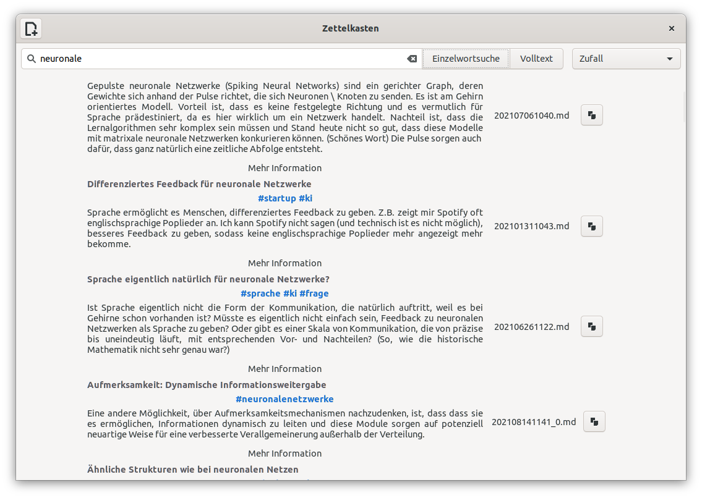

# zettelkasten-flatpak
# Zettelkasten-gtk

This is an app for the Zettelkasten principle. It is based on GTK. 
Its focus is on finding new ideas. 
It was born out of the frustration that other Zettelkasten apps 
try to map many of the capabilities of Markdown, 
which is not the main purpose of the Zettelkasten. 
The point of the Zettelkasten is to store ideas and 
find new ideas as efficiently as possible.

## Technologies

The app is based on Python and gtk.

* Python
* GTK+4
* GTK Source 5
* gobject-introspection
* Flatpak

## Setup

Use Gnome Build to create a flatpak. 

## Screenshot

 
